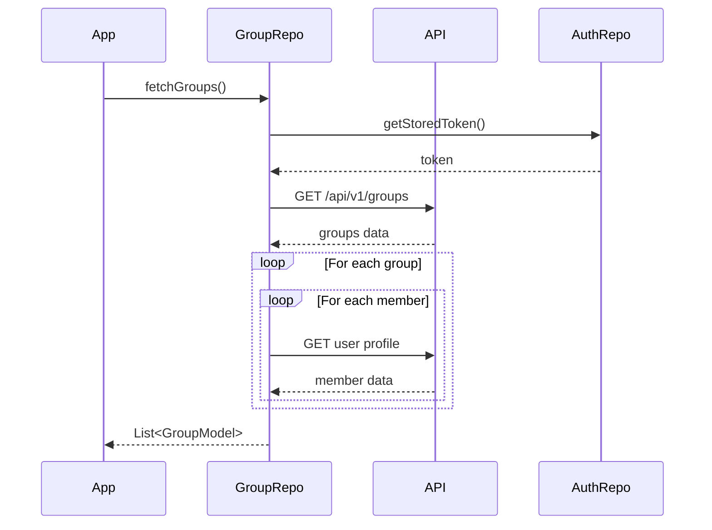
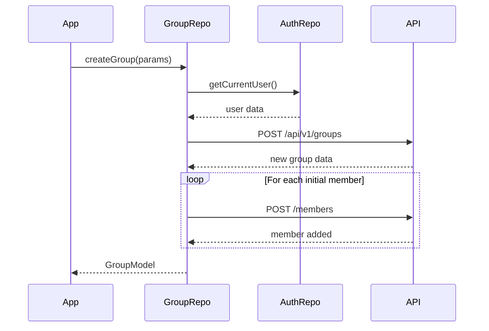
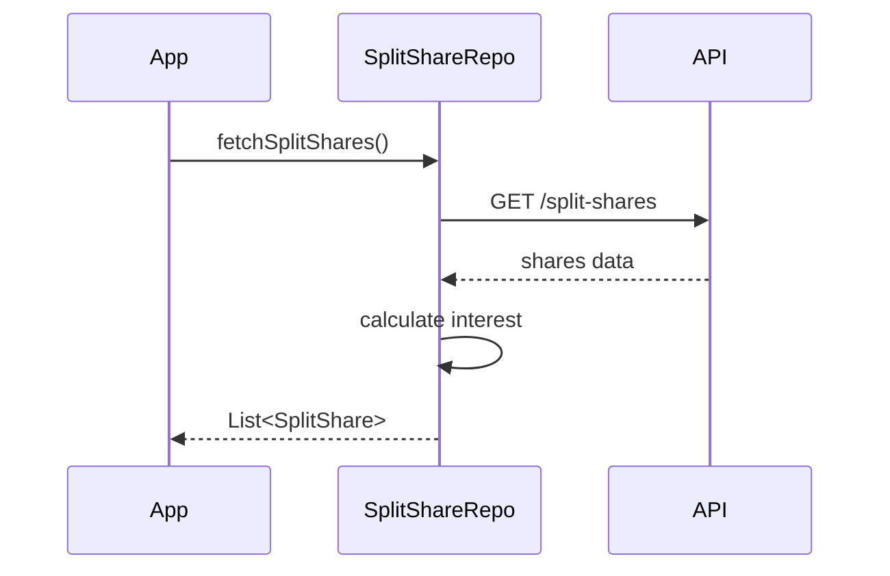
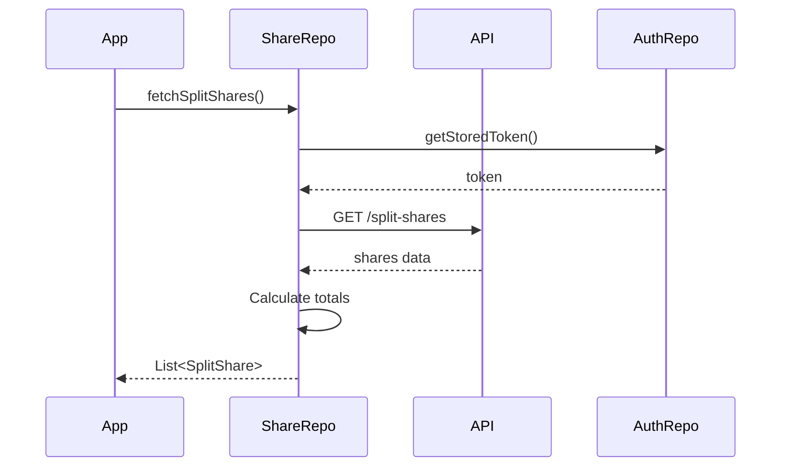
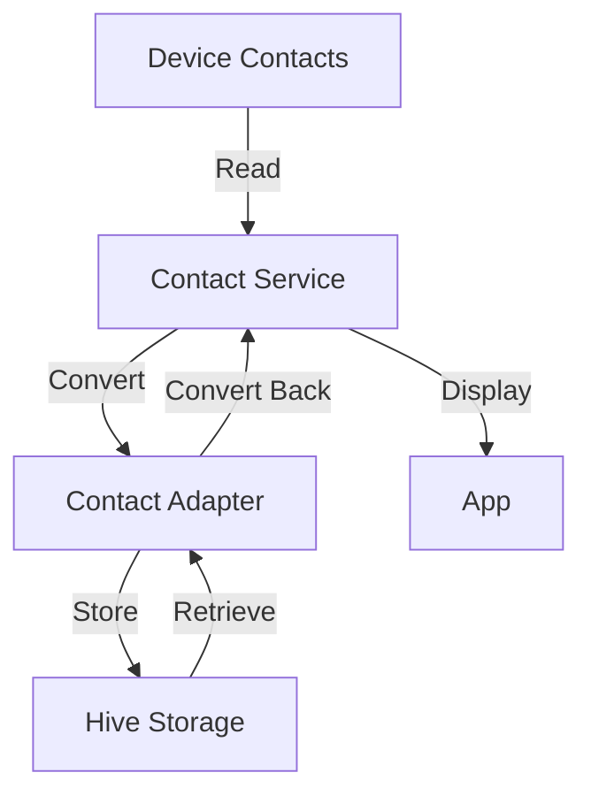
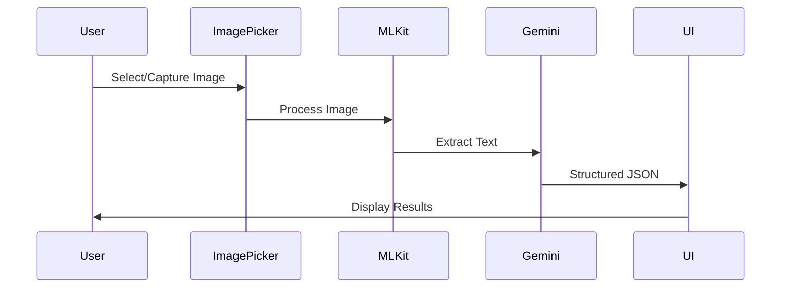
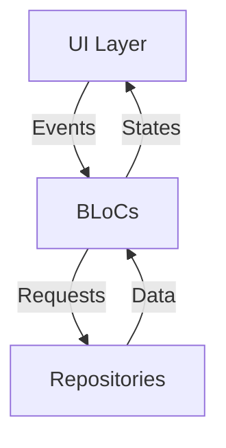

# FinGenie Repository Documentation
[](https://flutter.dev/)
[](https://dart.dev/)
[](https://bloclibrary.dev/)
[](https://docs.hivedb.dev/)
[](https://developers.google.com/ml-kit)
[](https://deepmind.google/technologies/gemini/)
[](https://golang.org/)
[](https://gofiber.io/)
[](https://www.postgresql.org/)
[](https://www.python.org/)
[](https://ngrok.com/)


## Table of Contents
- [FinGenie Repository Documentation](#fingenie-repository-documentation)
  - [Application Overview](#application-overview)
    - [Key Technologies](#key-technologies)
- [Flutter Application Architecture](#flutter-application-architecture)
  - [Application Initialization](#application-initialization)
  - [AuthRepository Guide](#authrepository-guide)
  - [Group Repository](#group-repository)
  - [Split Share Repository](#split-share-repository)
  - [Share Repository](#share-repository)
- [Services](#services)
  - [Contact Service](#contact-service)
  - [OCR Service](#ocr-service)
- [BLoC Pattern Implementation](#bloc-pattern-implementation)
  - [Authentication BLoCs](#authentication-blocs)
  - [Contacts BLoC](#contacts-bloc)
  - [Group BLoC](#group-bloc)
  - [Expense BLoC](#expense-bloc)
- [Development Setup](#development-setup)
- [Contributing](#contributing)
- [License](#license)

## Application Overview

FinGenie is a not-so-sophisticated financial management application that combines expense tracking, group expense management, and AI-powered receipt scanning. The application uses Flutter for cross-platform development and follows clean architecture principles.

### Key Technologies
- Flutter for UI development
- BLoC pattern for state management
- Hive for local storage
- Dio for network requests
- Google ML Kit for OCR
- Gemini AI for receipt analysis

# Flutter Application Archtitechture

## Application Initialization


### Main Application Setup
```dart
void main() async {
  try {
    // Initialize core services
    // Initialize repositories and services
    // Determine initial screen based on auth state and attach app to root
  } catch (e) {
    throw;
  }
}
```

### Initialize core services
```dart
    WidgetsFlutterBinding.ensureInitialized();
    await Hive.initFlutter();
    await dotenv.load(fileName: ".env");
```

### Initialize repositories and services
```dart
    await ContactsService.initializeHive();
    await AuthRepository.init();
```

### Determine the initial screen based on the auth state and attach the app to root
```dart
final userBox = await Hive.openBox<UserModel>('userBox');
    final currentUser = userBox.get('current_user');
    
    Widget initialScreen = currentUser?.isLoggedIn == true
        ? HomeScreen()
        : IntroScreen();
        
    runApp(MyApp(initialScreen: initialScreen));
```

## AuthRepository Guide

### Key Features
- User authentication (login/signup)
- Token management
- Local user data storage
- Profile updates

### Basic Usage

### Initialize Repository
```dart
// In your main.dart or startup code
await AuthRepository.init();
```

### Sign Up
```dart
final authRepo = AuthRepository();

try {
  final user = await authRepo.signUp(SignUpRequest(
    email: 'user@example.com',
    password: 'password123',
    name: 'John Doe',
    phoneNumber: '+1234567890'
  ));
  // User is now signed up and logged in
} catch (e) {
  // Handle signup error
}
```

### Login
```dart
try {
  final user = await authRepo.login(LoginRequest(
    email: 'user@example.com',
    password: 'password123'
  ));
  // User is now logged in
} catch (e) {
  // Handle login error
}
```

### Get Current User
```dart
final currentUser = authRepo.getCurrentUser();
if (currentUser != null) {
  print('User is logged in: ${currentUser.name}');
}
```

### Update Profile
```dart
final updatedUser = await authRepo.updateProfileLocally(
  currency: 'USD',
  age: 25,
  occupation: 'Developer',
  monthlyIncome: 5000.0
);
```

### Logout
```dart
await authRepo.logout();
// User is now logged out
```

#### `UserModel? getCurrentUser()`
Retrieves the currently logged-in user from local storage:
1. Opens user box if not already open
2. Returns stored user data or null if no user is found

#### `Future<void> verifyUserPersistence()`
Debug function to verify user data persistence:
1. Checks if user data exists in storage
2. Logs user details for verification
3. Reports any persistence issues

#### `Future<UserModel?> updateProfileLocally()`
Updates user profile information in local storage:
1. Updates currency preferences
2. Updates demographic information
3. Updates financial information
4. Persists changes to Hive storage

## Group Repository
The Group Repository manages all group-related operations including creation, member management, and data synchronization.

### Function Breakdown

#### `Future<List<GroupModel>> fetchGroups()`
Retrieves all groups associated with the current user:
1. Fetches groups from `/api/v1/groups`
2. Processes member data for each group
3. Fetches user profiles for all group members
4. Constructs complete group models with member information



Usage Example:
```dart
try {
  final groups = await groupRepository.fetchGroups();
  // Process retrieved groups
} catch (e) {
  // Handle fetch error
}
```

#### `Future<void> addGroupMembers()`
Adds new members to an existing group:
1. Validates member IDs
2. Makes individual requests for each member
3. Handles partial success scenarios
4. Updates group member list

Error Handling:
- Invalid member IDs
- Permission issues
- Network failures
- Partial success handling

Usage Example:
```dart
try {
  await groupRepository.addGroupMembers(
    groupId: 'group123',
    memberIds: ['user1', 'user2']
  );
  // Members added successfully
} catch (e) {
  // Handle member addition failure
}
```

#### `Future<String> findUserByPhone(String phoneNumber)`
Searches for a user by phone number:
1. Makes API request to user search endpoint
2. Processes response to extract user ID
3. Handles user not found scenarios

Usage Example:
```dart
try {
  final userId = await groupRepository.findUserByPhone('+1234567890');
  // Use found user ID
} catch (e) {
  // Handle user not found
}
```

#### `Future<GroupModel> createGroup()`
Creates a new group with specified parameters:
1. Validates input parameters
2. Sets up default values based on user preferences
3. Creates group on server
4. Processes response and creates local group model
5. Handles member addition if initial members provided

Error Handling:
- Input validation
- Server errors
- Member addition failures
- Currency validation



Usage Example:
```dart
try {
  final group = await groupRepository.createGroup(
    name: 'Weekend Trip',
    tag: 'trip',
    securityDepositRequired: true,
    securityDeposit: 1000.0,
    autoSettlement: true,
    initialMembers: ['user1', 'user2']
  );
  // Handle successful group creation
} catch (e) {
  // Handle creation failure
}
```

#### `Future<Map<String, dynamic>> getUserProfileById(String userId)`
Retrieves detailed user profile information:
1. Makes authenticated request to profile endpoint
2. Processes user data
3. Returns formatted user profile

#### `Future<GroupModel> getGroupDetails(String groupId)`
Fetches comprehensive group information:
1. Retrieves basic group data
2. Fetches all member profiles
3. Constructs complete group model with member details
4. Handles missing member data gracefully

## Split Share Repository
The Split Share Repository manages expense sharing calculations and settlements.

### Function Breakdown

#### `Future<List<SplitShare>> fetchSplitShares()`
Retrieves all split shares for the current user:
1. Fetches shares from API
2. Processes payment statuses
3. Calculates interest if applicable
4. Returns formatted share list



Usage Example:
```dart
try {
  final shares = await splitShareRepository.fetchSplitShares();
  // Process split shares
} catch (e) {
  // Handle fetch error
}
```


## Share Repository

The Share Repository manages expense sharing between users, including split calculations, balances, and settlements.

### Function Breakdown

#### `Future<List<SplitShare>> fetchSplitShares()`
Retrieves all active share splits for the current user:
1. Fetches all splits from `/api/v1/split-shares`
2. Calculates pending amounts
3. Processes payment status
4. Returns formatted split list



Usage Example:
```dart
try {
  final shareRepo = SplitShareRepository(dio: dio, apiUrl: apiUrl);
  final shares = await shareRepo.fetchSplitShares();
  // Process retrieved shares
} catch (e) {
  // Handle fetch error
}
```

## Services

### Contact Service
The contact management system combines the ContactService for handling operations and the HiveContact adapter for data persistence. This system manages device contacts, local caching, and data synchronization.



### Core Components

#### 1. Contact Service
Manages contact operations and synchronization:

```dart
class ContactsService {
  static const String contactsBoxName = 'contacts_box';
  static const String settingsBoxName = 'settings_box';
  
  // Initialize the service
  static Future<void> initializeHive() async {
    await Hive.initFlutter();
    Hive.registerAdapter(HiveContactAdapter());
    Hive.registerAdapter(HivePhoneAdapter());
    Hive.registerAdapter(HiveEmailAdapter());
  }
}
```

#### 2. Contact Adapter
Handles data conversion and storage format:

```dart
@HiveType(typeId: 10)
class HiveContact extends HiveObject {
  @HiveField(0) late String id;
  @HiveField(1) late String displayName;
  @HiveField(2) late List<HivePhone> phones;
  @HiveField(3) late List<HiveEmail> emails;
}
```

### Key Operations

#### 1. Fetching and Caching Contacts
```dart
// In Contact Service
Future<List<Contact>> fetchAndCacheContacts() async {
  if (await shouldRefreshContacts()) {
    final contacts = await FlutterContacts.getContacts(
      withProperties: true
    );
    
    // Convert and cache using adapter
    for (var contact in contacts) {
      final hiveContact = HiveContact.fromContact(contact);
      await contactsBox.put(hiveContact.id, hiveContact);
    }
    return contacts;
  }
  return getCachedContacts();
}
```

#### 2. Converting Contacts
```dart
// In HiveContact Adapter
factory HiveContact.fromContact(Contact contact) {
  return HiveContact(
    id: contact.id,
    displayName: contact.displayName
  )..phones = contact.phones
      .map((p) => HivePhone(number: p.number))
      .toList();
}
```

#### 3. Retrieving Cached Contacts
```dart
// In Contact Service
Future<List<Contact>> getCachedContacts() async {
  final contactsBox = Hive.box<HiveContact>(contactsBoxName);
  return contactsBox.values
    .map((hiveContact) => hiveContact.toContact())
    .toList();
}
```

### Usage Examples

#### 1. Initialize System
```dart
// In your app initialization
await ContactsService.initializeHive();
final contactService = ContactsService();
```

#### 2. Fetch and Display Contacts
```dart
try {
  final contacts = await contactService.fetchAndCacheContacts();
  // Use contacts in UI
} catch (e) {
  // Handle error
}
```

#### 3. Access Cached Contacts
```dart
final cachedContacts = await contactService.getCachedContacts();
// Use cached contacts
```

### Sync and Cache Management

#### Check for Updates
```dart
if (await contactService.shouldRefreshContacts()) {
  // Refresh contacts
  await contactService.fetchAndCacheContacts();
}
```

#### Clear Cache
```dart
await contactService.clearCachedContacts();
// Cache is cleared, next fetch will get fresh data
```


### OCR Service

#### Process Flow



### Key Steps

#### 1. Image Selection
- User can select image from gallery or capture with camera
- Image is optimized (1800px width, 85% quality)
- Selected image is displayed in UI

#### 2. OCR Processing
Uses Google ML Kit to:
- Convert image to text
- Extract text blocks
- Combine lines into processable text

#### 3. Gemini AI Analysis
Sends text to Gemini with prompt to extract:
- Store name
- Date
- Total amount
- Individual items
- Payment method

#### 4. Response Format
Gemini returns structured JSON:
```json
{
  "store": "Store Name",
  "date": "Purchase Date",
  "total": "Total Amount",
  "items": [
    {
      "name": "Item Name",
      "price": "Price",
      "quantity": "Quantity"
    }
  ],
  "paymentMethod": "Payment Method"
}
```

### Example Usage Flow
1. User opens receipt scanner
2. Selects/captures receipt image
3. System processes image for text
4. Gemini analyzes text for receipt data
5. UI displays formatted receipt with:
   - Store details
   - Item list
   - Total amount
   - Payment information

### Limitations
- Requires clear image quality
- Latin script support only
- Requires internet for Gemini analysis
- Depends on receipt format consistency

## BLoC Pattern Implementation

### Overview
The application uses several BLoCs to manage state for different features:
- Authentication (Login/Signup)
- Contacts Management
- Group Management
- Expense Tracking



### Authentication BLoCs

#### Login BLoC
Manages login state and authentication.

```dart
class LoginBloc extends Bloc<LoginEvent, LoginState> {
  final AuthRepository _authRepository;
  
  // Handle login submission
  Future<void> _onLoginSubmitted(event, emit) async {
    emit(LoginLoading());
    try {
      final user = await _authRepository.login(request);
      emit(LoginSuccess(user));
    } catch (error) {
      emit(LoginFailure(error.toString()));
    }
  }
}
```

States:
- `LoginInitial`: Initial state
- `LoginLoading`: During authentication
- `LoginSuccess`: After successful login
- `LoginFailure`: When login fails

Usage Example:
```dart
context.read<LoginBloc>().add(LoginSubmitted(
  email: 'user@example.com',
  password: 'password'
));
```

#### SignUp BLoC
Handles new user registration.

```dart
class SignUpBloc extends Bloc<SignUpEvent, SignUpState> {
  Future<void> _onSignUpSubmitted(event, emit) async {
    emit(SignUpLoading());
    try {
      final user = await _authRepository.signUp(request);
      emit(SignUpSuccess(user));
    } catch (error) {
      emit(SignUpFailure(error.toString()));
    }
  }
}
```

States:
- `SignUpInitial`: Starting state
- `SignUpLoading`: During registration
- `SignUpSuccess`: Registration successful
- `SignUpFailure`: Registration failed

### Contacts BLoC
Manages device contacts and synchronization.

```dart
class ContactsBloc extends Bloc<ContactsEvent, ContactsState> {
  Future<void> _onFetchContacts(event, emit) async {
    if (!await Permission.contacts.request().isGranted) {
      emit(state.copyWith(errorMessage: 'Permission denied'));
      return;
    }
    // Fetch and process contacts
  }
}
```

Events:
- `FetchContactsEvent`: Load contacts
- `RefreshContactsEvent`: Update contacts

States tracked:
- Loading state
- Contact list
- Error messages

### Group BLoC
Manages group operations and member management.

```dart
class GroupBloc extends Bloc<GroupEvent, GroupState> {
  // Load groups
  Future<void> _onLoadGroups(event, emit) async {
    emit(state.copyWith(isLoading: true));
    try {
      final groups = await repository.fetchGroups();
      emit(state.copyWith(groups: groups));
    } catch (e) {
      emit(state.copyWith(errorMessage: e.toString()));
    }
  }

  // Create group
  Future<void> _onCreateGroup(event, emit) async {
    // Group creation logic
  }

  // Add members
  Future<void> _onAddGroupMembers(event, emit) async {
    // Member addition logic
  }
}
```

Events:
- `LoadGroups`: Fetch groups
- `CreateGroup`: Create new group
- `AddGroupMembers`: Add members to group

States tracked:
- Group list
- Selected group
- Loading states
- Error messages

### Expense BLoC
Manages expense tracking and settlements.

```dart
class ExpenseBloc extends Bloc<ExpenseEvent, ExpenseState> {
  Future<void> _onLoadExpenses(event, emit) async {
    emit(ExpenseLoading());
    try {
      final expenses = await loadExpenses();
      emit(ExpenseLoaded(expenses));
    } catch (e) {
      emit(ExpenseError(e.toString()));
    }
  }
}
```

Events:
- `LoadExpenses`: Fetch expenses
- `AddExpense`: Create expense
- `SettleExpense`: Settle expense

States:
- `ExpenseInitial`
- `ExpenseLoading`
- `ExpenseLoaded`
- `ExpenseError`

### Usage Examples

#### Using Login BLoC
```dart
BlocBuilder<LoginBloc, LoginState>(
  builder: (context, state) {
    if (state is LoginLoading) {
      return CircularProgressIndicator();
    }
    if (state is LoginSuccess) {
      return HomeScreen();
    }
    return LoginForm();
  },
)
```

#### Managing Groups
```dart
BlocBuilder<GroupBloc, GroupState>(
  builder: (context, state) {
    if (state.isLoading) {
      return LoadingIndicator();
    }
    return ListView.builder(
      itemCount: state.groups.length,
      itemBuilder: (context, index) {
        return GroupTile(group: state.groups[index]);
      },
    );
  },
)
```


## Development Setup

### Prerequisites
- Flutter SDK (Latest stable version)
- Android Studio / VS Code
- Git
- A Google Cloud Platform account (for ML Kit)
- A Gemini API key

### Environment Setup
1. Clone the repository:
```bash
git clone https://github.com/yourusername/fingenie.git
cd fingenie
```

2. Install dependencies:
```bash
flutter pub get
```

3. Run build runner for code generation:
```bash
# One-time build
flutter pub run build_runner build

# Watch for changes
flutter pub run build_runner watch

# Force rebuild if conflicts occur
flutter pub run build_runner build --delete-conflicting-outputs
```

4. Create a .env file in the root directory:
```
GEMINI_API_KEY=your_api_key_here
API_BASE_URL=your_api_base_url
```

4. Run the development server:
```bash
flutter run
```

### Running Tests
```bash
flutter test
```

## Contributing

We welcome contributions to FinGenie! Please follow these steps:

1. Fork the repository
2. Create a new branch: `git checkout -b feature/your-feature-name`
3. Make your changes
4. Run tests: `flutter test`
5. Commit your changes: `git commit -m 'Add some feature'`
6. Push to the branch: `git push origin feature/your-feature-name`
7. Submit a pull request

### Code Style
- Follow the official Dart style guide
- Use meaningful variable and function names
- Write comments for complex logic
- Include tests for new features

### Pull Request Process
1. Ensure your code follows the style guide
2. Update the README.md with details of changes if needed
3. The PR will be merged once you have the sign-off of at least one maintainer

## License

This project is licensed under the MIT License - see the [LICENSE](LICENSE) file for details.


